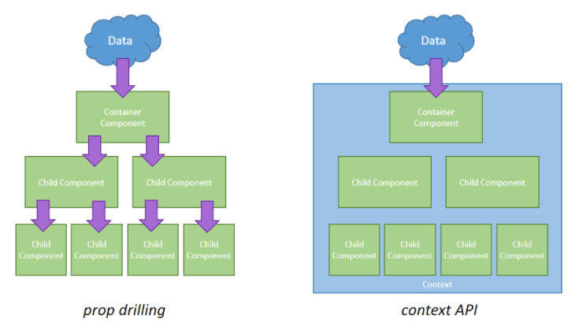

# React Hooks

React 에서 기존에 사용하던 Class를 이용한 코드를 작성할 필요 없이,
state와 여러 React 기능을 사용할 수 있도록 만든 라이브러리
<br><br>

### - Hook 개발과정

클래스 컴포넌트 사용 -> 2019년 2월 데이터 캐시를 개발\* -> 함수 컴포넌트와 리액트 훅을 사용

(함수 컴포넌트가 어떤 값을 유지할 수 있도록 '캐시'를 만들었고 이 캐시를 이용하고자 만든 여러개의 API를 'React hook' 함수라고 부름)
<br><br><br>
Hook은 함수 컴포넌트에서 React state와 생명주기 기능(Lifecycle features)을 “연동(hook into)“ 할 수 있음
<br><br>

### - Lifecycle (생명주기) ???

- mount : DOM이 생성되고 웹 브라우저상에 나타나는 것

- update : state 등 변경 시 업데이트 되는 것

  (props, state 변경, 부모컴포넌트 재렌더링, this.foceUpdate로 강제로 렌더링 트리거)

- unmount : 컴포넌트를 DOM에서 제거하는 것

컴포넌트의 생명주기를 알고 있어야 원하는 특정 시기에 코드를 실행할 수 있음 !!

<br><br>

<br>

<br><br>

# State Hook

### state : 컴포넌트의 상태

예를 들어, 시계라는 컴포넌트가 있다면 state로는 현재 시간을 가질 수 있음

<br>

## useState

: 컴포넌트의 state(상태)를 관리하여 상태에 따라, 다른 화면 출력

```jsx
// React에 기본적으로 내장되어 있는 useState 훅을 사용하면, state를 만들 수 있음
import { useState } from "react";

// 상태 유지 값과 그 값을 갱신하는 함수를 배열 형태로 반환
const [state, setState] = useState(initialState);
const [time, setTime] = useState(12);
```

state : 상태 유지 값

setState(state 변경함수) : state를 갱신할 때 사용 / 비동기 함수

initialState : 초기 렌더링 시 state의 초기값

**최초**로 렌더링 하는 동안에는 state 값이 첫 번째 전달된 인자(initialState)의 값과 같음

<br>

- state는 컴포넌트가 다시 렌더링 되어도 그대로 유지됨
- 하나의 컴포넌트 내에서 State Hook을 여러 개 사용 가능
- 많아질 수록 관리가 어려움

```jsx
// 클릭 횟수 카운트하는 함수
function App() {
    const [count, setCount] = useState(0);

    const handleClick = () => {
        setCount(count + 1); // setState를 사용하여 state를 변경하면 해당 컴포넌트는 재렌더링이 된다.
    }

    return (
        <>
        <span>Count : {count}</span>
        <button onClick={handleClick}> Update <button>
        </>
    )

}
```

**setState callback function**

- setNames([input, ...prevState]) 이렇게 해도 되지만, 여러개의 setState호출문이 같은 state를 동시에 업데이트를 시도할 경우는 콜백을 넣어주는것이 좋다

- 초기값을 가져올 때 무거운 작업을 해야한다면 콜백함수를 사용하면 됨.

- useState 초기값에 콜백형태로 넣어주면 최초 렌더링 시 한번만 함수를 가져옴

<br><br>

# Effect Hook

## useEffect

: 렌더링 이후에 실행할 코드를 만들 수 있고 특정 변수가 변경될 때마다, 특정기능이 작동하도록 할 수 있음

<br>

컴포넌트가 렌더링 될 때마다 매번 실행 (state 변경 시 컴포넌트 재랜더링)

<br>

```jsx
import { useEffect } from "react";

// 첫번째 인자 : 콜백함수 / 두번째 인자 : 배열

useEffect(() => {}, []);
```

<br>

### 언제 사용??

```jsx
// 어려운 연산 / 서버에서 데이터 가져오는 작업 / 타이머 등..
// 화면을 먼저 보여주고 동작하니 사용자 입장에서는 빠르게 화면을 볼 수 있음

useEffect(() => {
  for (var i = 0; i < 100000; i++) {
    console.log(1);
  }
});
```

<br>

### Ex]

```jsx
// 1)
useEffect(() => {
  console.log("렌더링 될 때마다 매번 실행");
});

// 2)
let [count, setCount] = useEffect(0);

useEffect(() => {
  console.log("렌더링 될 때(mount), count state가 업데이트 될 때");
}, [count]);

// 3)
useEffect(() => {
  console.log("mount 1회만 실행");
}, []);

// 4)
useEffect(() => {
  return () => {
    console.log("코드 실행 전에 항상 실행됨");
  };
});

// 5)
useEffect(() => {
  return () => {
    console.log("컴포넌트 unmount시 1회 실행");
  };
}, []);

// clean up function
useEffect(() => {
  // 2. 그 다음 실행
  let a = setTimeout(() => {
    setAlert(false);
  }, 2000);
  return () => {
    // 1. 먼저 실행
    // 기존 코드 제거 할 때 사용
    clearTimeout(a);
  };
}, []);
```

<br><br><br>

## useContext

: 기존의 React에 존재하는 Context를 더 편하게 사용할 수 있게 해주는, 전역적으로 데이터를 공유함

<br>

### context ?

여러 컴포넌트들에게 props를 전달해줘야 하는 경우 context를 이용하면 명시적으로 props를 넘겨주지 않아도 값을 공유할 수 있음

=> 데이터가 필요할 때마다 props를 통해 전달할 필요가 없이 context 를 이용해 공유

```jsx
import { createContext } from "react";
import Children from "./Children";

// AppContext 객체를 생성한다.
export const AppContext = createContext();

const App = () => {
  const user = {
    name: "아무개",
    job: "교사",
  };

  return (
    <>
      <AppContext.Provider value={user}>
        <div>
          <Children />
        </div>
      </AppContext.Provider>
    </>
  );
};

export default App;
```

```jsx
import { useContext } from "react";
import { AppContext } from "./App"; // context 불러오기

const Children = () => {
  // context 예제)
  // <AppContext.Consumer>
  //     {(user) => (
  //       <>
  //         <h3>AppContext에 존재하는 값의 name은 {user.name}입니다.</h3>
  //         <h3>AppContext에 존재하는 값의 job은 {user.job}입니다.</h3>
  //       </>
  //     )}
  // </AppContext.Consumer>

  // useContext 예제)
  const user = useContext(AppContext);
  return (
    <>
      <h3>AppContext에 존재하는 값의 name은 {user.name}입니다.</h3>
      <h3>AppContext에 존재하는 값의 job은 {user.job}입니다.</h3>
    </>
  );
};

export default Children;
```

### 장점 )

React에서 context 없이 변수나 함수를 다른 컴포넌트로 전달하려면

부모자식간에만 전달이 가능하므로,

컴포넌트가 많아질수록 불필요한 컴포넌트를 많이 거쳐야하는 문제가 발생한다 ( A -> B -> C -> D )

context를 이용하면, 중간과정을 재치고 직통으로 전달할 수 있다 ( A -> D )

<br>

### 유의점 )

전달하고자하는 컴포넌트에 context를 만들면, 불필요한 호출이 추가될 수 있으므로,
context 전용 파일을 만들어야 한다 !!

EX]

컴포넌트 : A, B, C, D ( A가 최상위 컴포넌트 )

전달 : A -> D

A 컴포넌트에 context 생성

D 컴포넌트에서 context 불러옴

<br>

실행 과정

1. A가 렌더링되며, B, C, D를 차례로 불러옴
2. D에서 context를 가져오기위해 A를 다시불러옴

   => A를 다시 불러오면서, 불필요한 중복이 발생함

<br>

### context vs props


