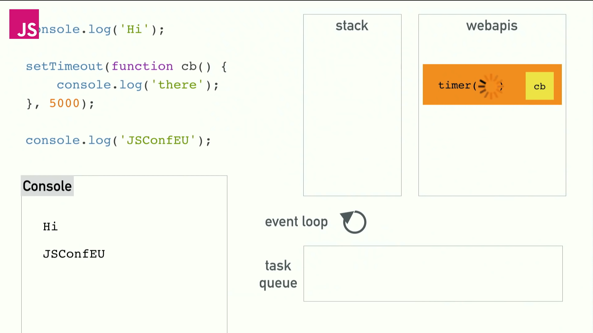

# 싱글스레드와 콜스택

자바스크립트는 기본적으로 **싱글 스레드** 언어이다.

즉, 한 번에 하나의 작업만을 수행할 수 있으며 하나의 콜스택이 있다.

# 블로킹

> 한번에 하나의 작업만 할 수 있다면 어떻게 웹사이트는 여러 작업을 동시에, 끊임없이 할 수 있는걸까?

엔진이 특정 태스크를 처리하는 동안에는 렌더링이 절대 일어나지 않는다. 즉, 한 태스크 처리에 긴 시간이 걸린다면, 다른 태스크 처리는 **블로킹**되고 브라우저는 다른 일을 할 수 없이 멈춰버린다.

블로킹이란, 말그대로 그저 느리게 동작하는 코드로 느린 동작이 스택에 남아있는 것이다. 블로킹은 유려한 UI를 만드는데 방해가 된다. 그럼 이걸 어떻게 해결할 수 있을까?

# 비동기 콜백

제일 쉽게 접할 수 있는건 **비동기 콜백(Asynchronous Callbacks)** 이다.

V8 엔진 소스 안에는 우리가 비동기 호출을 위해 사용하는 비동기 함수(setTimeout이나 XMLHttpRequest 등)와 관련된 구현이 없다. ~~당연하게도~~ `V8 엔진 === 브라우저`가 아니다. 브라우저는 단순 자바스크립트 런타임 이상을 의미한다. (하나의 콜스택과 하나의 힙을 가진) V8엔진 외에도 Web API, 콜백 큐 그리고 이 세 개를 바라보는 이벤트루프로 구성되어있다.

비동기 함수들은 자바스크립트 엔진이 아닌 브라우저 환경의 WebAPI 영역에 따로 정의되어있다. (노드 환경도 마찬가지이다) 브라우저나 노드에는 블로킹 함수가 거의 없다. 대부분의 함수는 비동기로 만들어져 있다. (코드를 실행하면 콜백을 받고 그 콜백을 나중에 실행한다는 뜻이다.)

# 이벤트 루프와 동시성

자바스크립트 런타임 (V8 엔진)은 한 번에 하나의 일만 할 수 있다는건 변하지 않았다. 브라우저의 WebAPI는 비동기 함수들을 제공하고 이것이 자바스크립트의 스레드를 효과적으로 지원한다. **여기서 동시성이 들어오게 된다.**

```javascript
console.log("Hi");

setTimeout(function cb() {
  console.log("there");
}, 0);

console.log("Bye");
```

🤔 _이 코드는 어떻게 실행될까?_

1. Hi 출력 => there 출력 => Bye 출력
2. Hi 출력 => Bye 출력 => there 출력

정답은 (2) 이다.

</img>

1. `console.log('Hi');` 가 콜 스택에 쌓이고 실행된다.
2. `setTimeout cb` 가 콜 스택에 쌓이고 실행된다. `setTimeout` 은 브라우저에서 제공하는 API (WebAPI)이고 V8 소스코드에 존재하지 않는다는 것을 기억하는가? V8엔진은 WebAPI를 호출하고 콜 스택에서 치워버린다. WebAPI를 '호출' 했다는 것에서 이미 V8 엔진의 롤은 끝난 것이다.
3. V8 엔진은 `console.log('Bye')` 를 콜 스택에 쌓고 이를 실행시킨다.
4. 브라우저가 0초 타이머를 실행시키고 콜백함수가 남아있다. 하지만 이 콜백 함수는 갑자기 콜 스택에 끼어들 수는 없다. WebAPI는 작동이 완료되고 나면 남은 콜백을 테스크 큐에 밀어넣는다.
5. 이벤트 루프는 태스크 큐와 콜 스택을 감시하고 있다가 콜 스택이 비어있으면 태스크 큐에서 콜백을 꺼내다가 넣는다. 따라서 맨 마지막에 `console.log('there')` 이 실행되는 것이다.

모든 WebAPI는 동일한 방식으로 동작한다. Ajax 요청에서도 마찬가지이다. XHR Web API가 실행되는 동안 다른 코드가 정상적으로 실행될 수 있는 (즉, 블로킹 되지않는) 원리가 이것이다.

# 랜더링과 동시성

```HTML
<div id="progress"></div>

<script>

  function count() {
    for (let i = 0; i < 1e6; i++) {
      i++;
      progress.innerHTML = i;
    }
  }

  count();
</script>
```

🤔 _이 코드는 어떻게 실행될까?_

우리는 1부터 999999까지 올라가는걸 기대하지만, 실상은 브라우저가 멈췄다가 999999가 찍힌다. 이게 바로 **블로킹** 이다. 여기에는 랜더링이 끼어들 공간이 없다.

브라우저는 현재 작업중인 태스크가 끝나야만 DOM 변경분을 화면에 렌더링해줄 수 있다. (완성되지 않은 중간 상태의 화면이 사용자에게 노출되는 것을 막아주기 위해 그렇게 동작한다.)

🤔 _우리가 원하는대로 1부터 999999가 찍히는걸 보려면 어떻게 해야할까?_

```HTML
<div id="progress"></div>

<script>
  let i = 0;

  function count() {

    // 무거운 작업을 쪼갠 후 이를 수행
    do {
      i++;
      progress.innerHTML = i;
    } while (i % 1e3 != 0);

    if (i < 1e7) {
      setTimeout(count);
    }

  }

  count();
</script>
```

`setTImeout`으로 스케줄링해줌으로서 render가 끼어들수 있게 되었다.

이게바로 Ajax Call 하는동안 우리는 브라우저로 다른 일을 할 수 있는 이유이다.

# 매크로태스크와 마이크로태스크

태스크는 매트로태스크(macrotask)와 마이크로태스크(microtask)로 나뉜다.

마이크로태스크는 **코드를 사용해서만** 만들 수 있다. (주로 promise를 사용해서 만든다.)

자바스크립트 엔진은 매크로태스크를 하나 처리할 때마다 마이크로태스크 큐에 쌓인 마이크로태스크를 전부 처리한다. (전부 처리하고 나면 또 다른 매크로태스크를 처리하거나 렌더링 작업을 한다.)

1. 매크로태스크 큐에서 가장 오래된 태스크를 꺼내 실행한다.
2. 마이크로태스크 큐가 빌 때까지 오래된 순서대로 모든 마이크로태스크 큐를 실행한다.
3. 랜더링을 수행한다.
4. 1번으로 돌아간다.

# 참고 자료

- [What the heck is the event loop anyway? | Philip Roberts | JSConf EU](https://youtu.be/8aGhZQkoFbQ)
- [JAVASCRIPT.INFO : 이벤트 루프와 매크로태스크, 마이크로태스크](https://ko.javascript.info/event-loop)
- https://meetup.toast.com/posts/89
- https://stackoverflow.com/questions/25915634/difference-between-microtask-and-macrotask-within-an-event-loop-context
