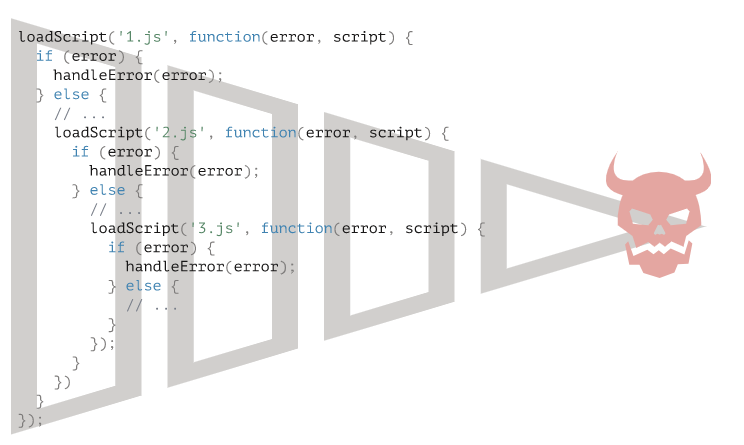
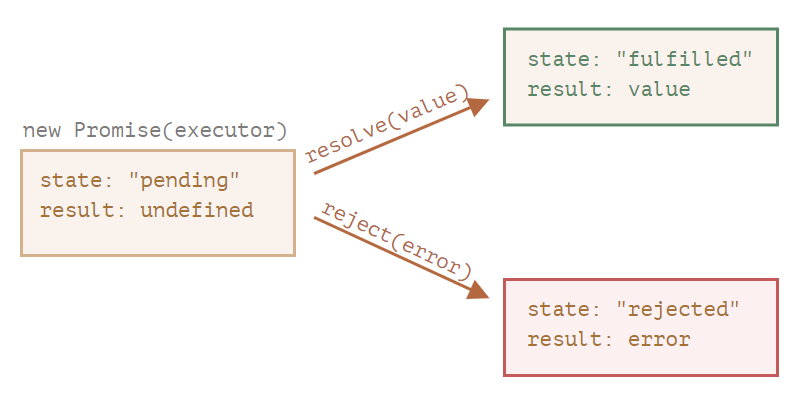

# 개요

`promise`는 특별한 자바스크립트 객체이다.

피자집과 손님이 있다고 가정해보자. 손님은 피자가 준비될 때까지 매번 피자집에 '준비되었냐'고 물어봐야할까? 그건 너무 비효율적인 일이다. 손님은 전화번호를 주고, 피자집은 완료되면 손님에게 전화를 해주면 될 것이다.

> `promise` 는 피자집이고, `then` `catch` 등은 손님이다.

이전 시간에서 비동기 처리 이후에 동기적으로 실행되어야 하는 로직을 콜백 함수에 넣는다고 이야기했는데, 만약 이런 호출이 꼬리에 꼬리를 문다면 아래같은 **콜백 지옥**이 만들어진다.

</img>

앞서 말한 '피자집과 손님' 개념을 통해서 이런 콜백 지옥을 해결할 수 있다. 피자집이 피자가 준비되면 손님에게 전화를 하는 것 처럼 `promise`는 비동기 처리가 끝났음을 알린다.

# Promise

`promise`는 특별한 자바스크립트 객체 - 그중에서도 **비동기 처리에 사용되는 특별한 객체**라고 했다.

```javascript
let promise = new Promise();
```

`promise` 객체는 위와 같은 문법으로 만들 수 있다.

```javascript
let promise = new Promise(function (resolve, reject) {
  // ...
});
```

`promise` 객체를 만들 때 생성자에 execute 함수 (위에선 `function(resolve, reject) {}`)를 넘길 수 있는데 이는 `promise` 객체가 만들어질 때 자동으로 실행된다.

그럼 execute 함수의 인자인 `resovle` 와 `reject`는 무엇일까? 자바스크립트에서 자체 제공하는 콜백 함수인데, 우리는 execute 함수 내부에서 `resolve`, `reject` 중 하나를 반드시 호출해야한다.

- `resolve(value)` : 일이 성공적으로 끝난 경우 _(피자가 만들어진 경우)_ 그 결과를 나타내는 `value`와 함께 `resovle`를 호출한다.
- `reject(error)` : 에러 발생 시 에러 객체를 나타내는 `error` 와 함께 `reject`를 호출한다.

왜 호출하는지를 알기 위해서는 `new Promise` 생성자가 반환하는 promise 객체의 프로퍼티를 알아야한다. `promise`는 `state`, `result`라는 두 개의 내부 프로퍼티를 가진다.

</img>

- state : 처음에는 값이 `pending` (대기) 였다가 `resolve` 가 호출되면 `fulfilled` (이행) 로, `reject` 가 호출되면 `rejected` (거부) 로 변한다.
- result : 처음에는 값이 `undefined`이었다가 `resovle(value)` 가 호출되면 `value`로, `reject(error)` 가 호출되면 `error`로 변한다.

> **프라미스는 성공 또는 실패만 한다.** executor 함수 안에서 `resolve`나 `reject` 중 하나를 반드시 호출해야해야 하지만 하나를 호출 한 이후 다른 걸 호출한다해도 상태는 더 이상 변하지 않는다.

🤔 _그래서 이 `state`, `result`를 어떻게 구독하는 것일까?_

# then, catch, finally

`new Promise` 를 통해 `promise`를 만들면 execute 함수가 자동 실행되고 (execute 내부에선 `resolve`, `reject` 함수를 호출하는 것이 필수이므로) `resolve`나 `reject` 가 호출되어 `promise`의 `state`, `result`가 변한다고 했다. 그럼 이 `state`와 `result`는 어떻게 구독할까?

_(앞으로 소비함수라 부를)_ `.then`, `.catch`, `.finally`를 통해 이 값을 구독(사용)할 수 있다.

## then

```javascript
promise.then(
  function (result) {
    /* 결과(result)를 다룹니다 */
  },
  function (error) {
    /* 에러(error)를 다룹니다 */
  }
);
```

`.then` 의 첫 번째 인자는 프라미스가 fulfilled 상태가 되면 실행되는 함수이고, 여기서 실행 결과인 `value`를 받는다.

`.then` 의 두 번째 인자는 프라미스가 rejected 상태가 되면 실행되는 함수이고, 여기서 에러인 `error` 를 받는다.

자바스크립트 특성상 반드시 두 개의 인자를 넘겨주지 않아도 된다. 작업이 성공적으로 처리된 경우만 다루고 싶다면, `.then` 에 인자를 하나만 전달하면 된다. (반면, 작업이 에러 났을 때만 다루고 싶다면 `.then(null, f)` 이렇게 두 번째 인자만 전달하면 된다.)

## catch

에러가 발생한 경우만 다루고 싶다면 앞서 설명한 것처럼 `.then(null, f)` 처럼 해도 되지만 이것 대신에 `.catch` 를 사용하면 된다.

> `.then(null, f)` === `.catch(f)`

## finally

그럼 에러가 발생하든, 성공적으로 수행되었든 항상 실행하고 싶은 로직의 경우는 어떻게 하면 될까? 물론 `.then(f, f)` 같은 방식으로 작성해도 되지만 이것 대신에 `.finally`를 사용하면 된다.

🤔 그럼 `.then(f, f)` === `.finally` 일까?
🙅‍♀️ 아니 완전히 같지는 않다

1. `finally` 핸들러에는 인수가 없다. `promise` 가 fulfilled인지 rejected 인지 알 필요가 없기 때문이다. `finally` 내부에서는 절차를 마무리하는 보편적인 동작만을 수행하기 때문에 성공여부는 몰라도 된다.
2. `finally` 핸들러는 자동으로 다음 핸들러에 결과와 에러를 전달한다.

# 예시

그럼 이 promise를 어떻게 활용할 수 있는 것일까?

실무에서 맞닥뜨리는 비동기 동작은 아주 다양하다. 스크립트를 로딩하는 것 또한 비동기 동작이다.

특정 스크립트를 동적으로 append하고, 로딩이 완료되면 해당 스크립트안의 function을 call하는 함수를 작성해보자.

```javascript
function loadScript(src, callback) {
  let script = document.createElement("script");
  script.src = src;

  script.onload = () => callback(null, script);
  script.onerror = () =>
    callback(new Error(`${src}를 불러오는 도중에 에러가 발생했습니다.`));

  document.head.append(script);
}

loadScript("/my/script.js", function (error, script) {
  if (error) {
    // 에러 처리
  } else {
    // 스크립트 로딩이 성공적으로 끝남
  }
});
```

이를 promise로 작성한다면? _promise 기반의 함수라는 것은 별다른게 아니고 promise 객체를 return하는 함수인 것이다_

```javascript
function loadScript(src) {
  return new Promise(function (resolve, reject) {
    let script = document.createElement("script");
    script.src = src;

    script.onload = () => resolve(script);
    script.onerror = () =>
      reject(new Error(`${src}를 불러오는 도중에 에러가 발생했습니다.`));

    document.head.append(script);
  });
}

loadScript("/my/script.js")
  .then((script) => {
    // 스크립트 로딩이 성공적으로 끝남
  })
  .error((error) => {
    // 에러 처리
  });
```

이게 콜백 보다 뭐가 좋은걸까? 먼저 코드를 읽는 흐름이 자연스러워진다. 또한 callback 방식에서는 loadScript를 호출할 때에 callback을 넘겨줘야하므로 호출하기도 전에 호출 결과로 수행하는 action에 대해서 미리 알고 있어야 한다. (그래야 callback 함수를 작성할테니) 하지만 프라미스를 사용하면 호출 결과로 수행할 내용을 `.then`에 작성해주면 그만이다. 무엇보다 프라미스에서는 원하는 만큼 `.then`을 호출할 수 있다.

# 프라미스 체이닝

스크립트를 불러오는 것과 같이 순차적으로 처리해야하는 비동기 작업이 여러 개 있다고 가정해보자.

```

```

# 참고 자료

- [JAVASCRIPT.INFO : 프라미스](https://ko.javascript.info/promise-basics)
- [JAVASCRIPT.INFO : 콜백](https://ko.javascript.info/callbacks)
- [JAVASCRIPT.INFO : 프라미스 체이닝](https://ko.javascript.info/promise-chaining)
