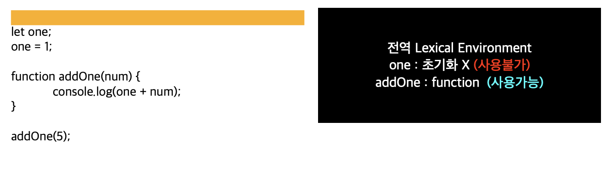

# 호이스팅
스코프 내부 어디서든 변수 선언은 최상위에 선언된 것처럼 행동하는 것

호이스팅은 스코프 단위로 일어난다. 스코프 단위로 호이스팅이 일어난다는게 무슨 뜻인지는 아래 TDZ와 변수의 생성과정에서 다시 이야기하겠다.


# TDZ (Temporal Dead Zone)
ES6에 추가된 Scope와 관련된 새로운 개념이다. `var` 과 `let/const`와의 가장 큰 차이는 후자만이 TDZ 시맨틱의 영향을 받는다는 것이다. TDZ 시맨틱의 영향을 받는 다는 것은, 초기화되기 전에 읽기, 쓰기를 위해 접근할 경우 레퍼런스 에러가 발생한다는 뜻이다. 이것은 코드를 예측 가능하게 만든다.


# 변수의 생성과정
변수의 생성 과정은 총 3단계를 거친다.
1. 선언 단계
2. 초기화 단계 : undefined 를 할당해주는 단계
3. 할당 단계

* var 는 (1), (2)가 함께 일어난다.
* let 은 (1)과 (2)가 따로 일어난다.
* const은 (1), (2), (3)이 함께 일어난다.

</img>

위 코드는 왜 레퍼런스 에러가 발생하는 것 일까? let은 호이스팅 되지 않는 것일까? 쉽게 할 수 있는 오해 중 한 가지가 'let은 호이스팅 되지 않는다'는 것이다. **하지만 let에도 호이스팅이 일어난다.** 호이스팅 되면서 1번 선언 단계가 이루어지지만, 초기화 단계는 실제 코드에 도달했을 때 이루어지기 때문에 오류가 나는 것이다.

let, const 변수는 포함하는 Lexical Environment가 인스턴스화될 때 생성되지만 (즉, 호이스팅 된다.) 변수의 LexicalBinding이 평가될 때까지 어떤식으로든 액세스할 수 없다. (즉, 초기화 단계가 일어날 때까지 사용할 수 없고 TDZ의 영향을 받는다.)

Lexical Environment가 인스턴스화 된다는 게 무슨 말일까?

# Lexical Envrionment와 클로저

호이스팅은 스코프 단위로 일어난다고 했다. 새로운 스코프로 진입하면 (module, function, block 스코프) 코드가 실행되기 전에, 해당 스코프 내의 모든 `let/const` 가 인스턴스화 된다. 이것을 다르게 말하면 `let/const` 가 호이스팅 되는 것 이다.

</img>

새로운 스코프에 진입하면 스크립트 내에서 선언한 변수들이 Lexical Environment 에 올라간다. 하지만 여기서 `one`은 TDZ 시맨틱의 영향을 받아 사용할 수 없는 상태이다.

</img>

`one` 변수는 실제 코드에 도달했을 때 사용할 수 있게 된다.

</img>

함수를 호출하면 우리는 새로운 스코프로 진입하게 되고 (function 스코프) 해당 스코프 내에서 선언한 변수들 (함수 파라미터를 포함해서) Lexical Environment에 올라간다. 내부 Lexical Environment는 외부 Lexical Environment를 참조하고 있는데, 코드에서 변수를 찾을 때 내부에서 먼저 찾고, 없으면 외부로 올라가서 찾고 - 를 반복해서 찾는다.


한 가지 예를 더 살펴보자.

</img>

</img>

`makeAdder` 함수가 실행 될 때 Lexical Envrionment가 만들어지고 파라미터인 x가 올라간다. 

</img>

`add3` 함수가 실행 될 때 Lexical Envrionment가 만들어지고 파라미터인 y가 올라간다. `x + y` 가 실행될 때 x`를 Lexical Envrionment에서 찾고 없으니 상위 Lexical Envrionment로 가서 찾는다. 즉, 이 함수는 y는 자신이 가지고 있고 상위함수인 makeAdder의 매개변수인 x 에 접근 가능하다. **이것이 바로 클로저이다.**

클로저는 함수와 그 함수의 렉시컬 환경의 조합이다. 함수가 생성될 당시의 외부 변수를 기억하고, 생성된 이후에도 계속 그 변수에 접근가능하다. - 라는 것이 바로 이런 것이다.


# 클로저

호출할 때 마다 1씩 증가하는 숫자를 내뱉는 counter 함수를 작성한다고 생각해보자.

```javascript
let num = 0;

function counter() {
    return ++num;
}

console.log(counter()); // 1
console.log(counter()); // 2
console.log(counter()); // 3
```

여기서 전역변수를 사용하고 싶지 않다면 어떻게 해야할까?
전역변수 num을 함수 안으로 집어넣는다면 해결될까?

```javascript
function counter() {
    let num = 0;

    return ++num;
}

console.log(counter()); // 1
console.log(counter()); // 1
console.log(counter()); // 1
```
(당연하게도) 안된다. counter를 호출할 때마다 지역변수 num을 초기화하기 때문에 이전의 상태를 기억하지 못한다. 그러면 반드시 전역변수를 사용해야하는 것일까? 이것을 클로저로 해결할 수 있다.

```javascript
function makeCounter() {
    let num = 0;

    return function () {
        return ++num;
    }
}

const counter = makeCounter();

console.log(counter()); // 1
console.log(counter()); // 2
console.log(counter()); // 3
```

makeCounter조차 만들고 싶지않다면, 즉시 실행함수를 사용하면 된다.

```javascript
let counter = (function () {
    let num = 0;

    return function () {
        return ++num;
    }
}());

console.log(counter()); // 1
console.log(counter()); // 2
console.log(counter()); // 3
```

즉시실행함수가 호출되면 `counter`에는 `function () { return ++ counter }` 가 할당된다. 이 함수는 자신이 생성됐을 때의 렉시컬 환경을 기억하는 클로저이라 `num`을 기억하고 있다. `num`은 자신을 참조하는 함수가 (여기선 counter) 가 소멸될 때 까지 유지된다. 즉시실행함수는 한번만 호출되므로 -  `num`이 0으로 초기화 될 일은 없다. 또한 `num`은 외부에서 직접 접근할 수 없게 되었다. 즉, 클로저로 `private` 를 흉내낸것이다!

# 모듈 패턴

클로저를 사용해서 프라이빗 변수와 프라이빗 함수에 접근하기 위한 퍼블릭 함수를 만드는 방법으로, 이렇게 클로저를 사용하는 것을 모듈 패턴이라고한다.


`counter.increment` `counter.decrement` `counter.value` 세 함수에 의해 공유되는 하나의 어휘적 환경을 만들었다.

```javascript
var counter = (function() {
    // 프라이빗 변수
    var privateCounter = 0;

    // 프라이빗 함수
    function changeBy(val) {
    privateCounter += val;
    }

    // 퍼블릭 함수
    return {
    increment: function() {
        changeBy(1);
    },
    decrement: function() {
        changeBy(-1);
    },
    value: function() {
        return privateCounter;
    }
    };
})();

console.log(counter.value()); // 0
counter.increment();
counter.increment();
console.log(counter.value()); // 2
counter.decrement();
console.log(counter.value()); // 1
```

# 참고 자료
- [MDN | 클로저](https://developer.mozilla.org/ko/docs/Web/JavaScript/Closures)

- [모던 자바스크립트 | 클로저](https://poiemaweb.com/js-closure)

- [TEMPORAL DEAD ZONE (TDZ) DEMYSTIFIED](http://jsrocks.org/2015/01/temporal-dead-zone-tdz-demystified)

- [자바스크립트 중급 강좌 #11 클로저(Closure) 5분만에 이해하기](https://youtu.be/tpl2oXQkGZs)