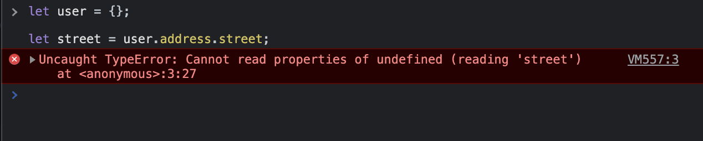
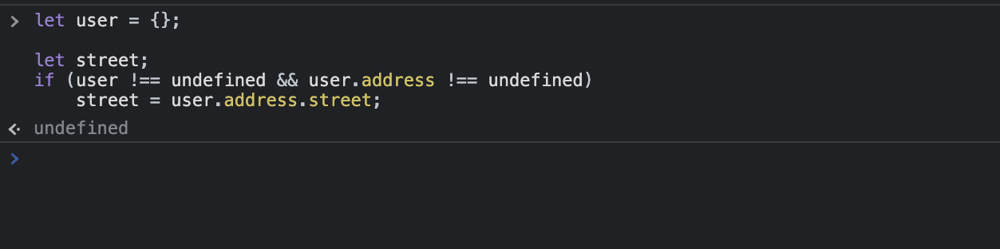
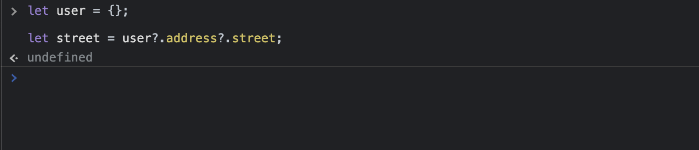
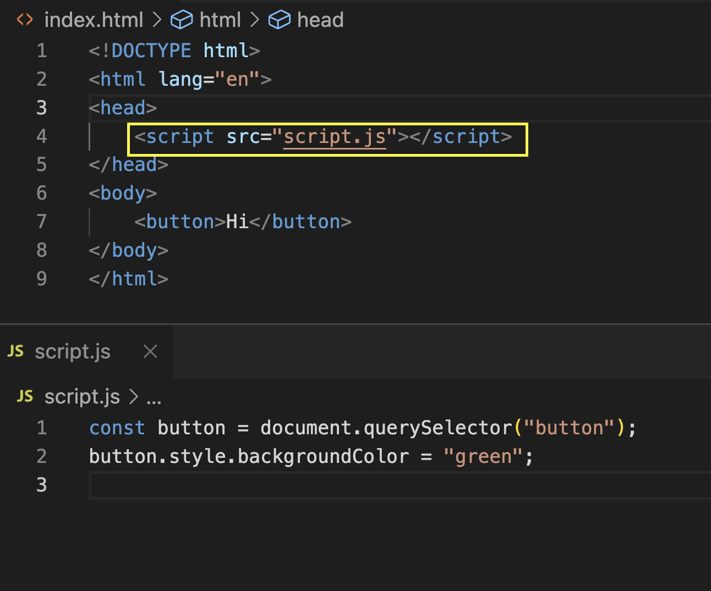
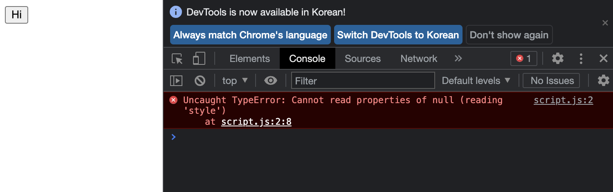
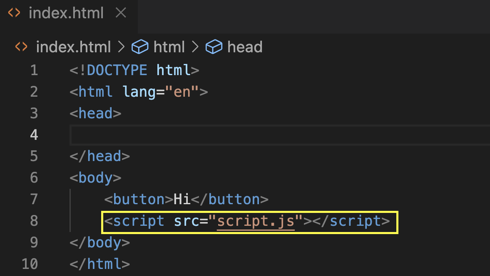
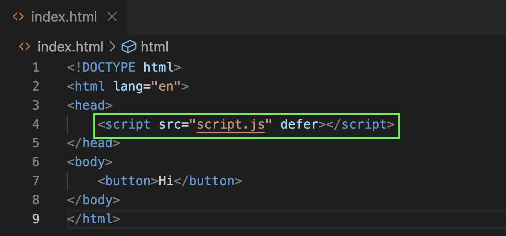

# Optional Chaining (?.)

</img>

없는 프로퍼티에 접근하면 위처럼 오류가 난다.

</img>

이것을 방지하기 위해 지금까지는 조건문을 사용했었지만,

</img>

ES11부터 `?.` 연산자를 지원해서 위처럼 사용할 수 있다.
`?.`는 앞의 평가 대상이 `undefined` 나 `null` 이면 평가를 멈추고 `undefined` 를 반환한다.

# Nullish Coalescing (??)

```javascript
function sayMyName(name) {
  return (name || "이름없음") + "입니다";
}
```

위 코드의 문제점은 뭘까?

```javascript
function sayMyAge(age) {
  return (age || "10") + "살 입니다!";
}

sayMyAge(); // 10살 입니다!
sayMyAge(undefined); // 10살 입니다!
sayMyAge(null); // 10살 입니다!
sayMyAge(0); // 10살 입니다! (??!원하지 않는 동작)
```

0도 false로 판단하기 때문에 위 같은일이 일어난다.
이를 위해 나온것이 `??` 이다. (ES11)

```javascript
function sayMyAge(age) {
  return (age ?? "10") + "살 입니다!";
}

sayMyAge(); // 10살 입니다!
sayMyAge(undefined); // 10살 입니다!
sayMyAge(null); // 10살 입니다!
sayMyAge(0); // 0살 입니다! (good)
```

null, undefined <=> 0 을 구분지어 다루어야 할 때 유용하게 사용할 수 있다.

# &&= , ||= , ??=

```javascript
/* old JS */
let a = 1;
if (a) a = 2;

/* new JS */
let a = 1;
a &&= 2; // 변수가 거짓(Falsy)이 아니라면 업데이트 된다
```

```javascript
/* old JS */
let a = false;
if (!a) a = true;

/* new JS */
let a = false;
a ||= true; // 변수가 참이 아니라면 업데이트 된다
```

```javascript
/* old JS */
let a = undefined;
if (a === undefined || a === null) a = "hello";

/* new JS */
let a = undefined;
a ??= "hello"; // 변수가 null이거나 undefined이면 업데이트 된다
```

# defer

</img>

위 소스는

</img>

이렇게 오류가 난다. 브라우저는 HTML을 파싱하다가 자바스크립트를 만나면 HTML를 읽는 것을 멈추고 자바스크립트를 읽는다. 아직 `button` 이 생기지 않았는데, `button` 에 접근해서 스타일을 조작하려 하니 오류가 나는 것이다.

</img>

이를 방지하기 위해, 지금까지는 스크립트를 맨 하단에 두었다.

하지만 `defer`를 사용하면 자바스크립트를 헤더에 두어도 된다.

</img>

# Top Level await

지금까지는 `await` 키워드를 사용하려면 무조건 `async` 함수 안에서 썼어야 했다.

따라서

```javascript
(async function () {
  await getData();
})();
```

이렇게 즉시실행함수로 감싸주곤 했는데 (아니면 async 함수를 만들어서 호출한다거나) 이젠 더이상 그럴 필요가 없다. 더이상 `await` 는 `async` 함수 안에서만 사용할 수 있다는 규칙이 사라졌다!

```javascript
await getData();
```

이젠 그냥 이렇게 쓰면 된다.

# .at()

```javascript
const arr = [0, 1, 2, 3, 4];

arr[3];   // 이거는
arr.(3);  // 이거랑 똑같다

arr[-1];            // 는 안되지만
arr[arr.length - 1] // 그래서 이렇게 해줘야 했는데
arr.at(-1);         // 이젠 이렇게 된다

```

# 참고 자료

- [모르면 안되는 JS 최신 기능](https://youtu.be/yn32aDWUgZU)
- [5 Must Know JavaScript Features That Almost Nobody Knows](https://youtu.be/v2tJ3nzXh8I)
