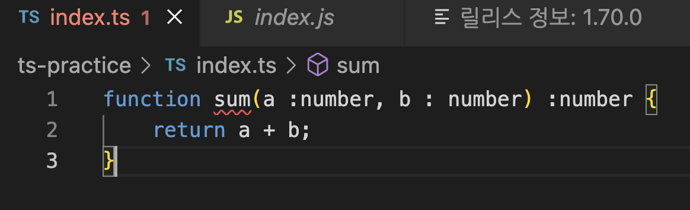
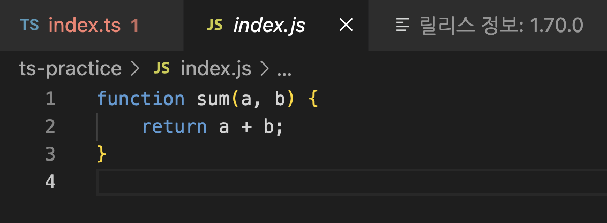
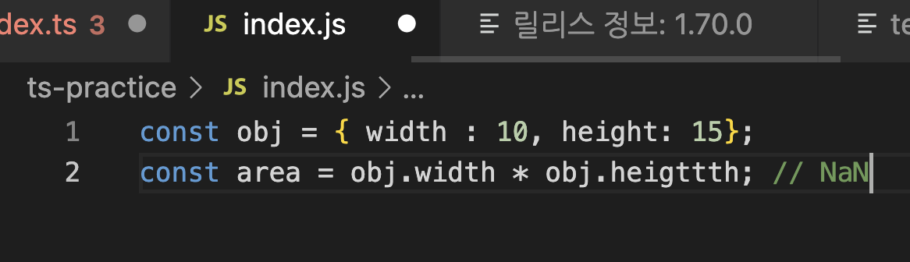
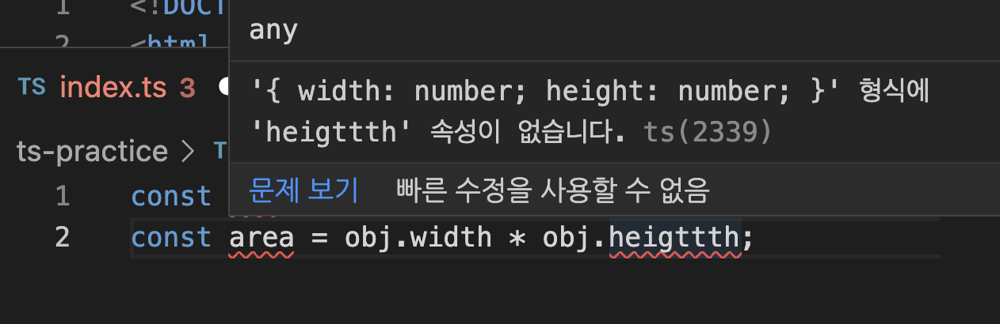

# 타입스크립트란?

> TypeScript is Typed JavaScript.

> TypeScirpt is JavaScript's runtime with a compile-time type checker.

TypeScript (이하 TS)는 JavaScript 위에 레이어로서 자리잡고 있다. JS의 기능을 제공하며, 그 위에 자체 레이어를 추가한다. (TS는 JS의 슈퍼셋이다.) **여기서 레이어란, TS의 타입 시스템이다.** JS는 string, number, object, undefined 같은 원시 타입을 가지고 있지만, 일관되게 할당되었는지를 미리 확인해주지는 않는다. TS는 이 레이어로서 동작한다.

TS를 브라우저에서 실행하기 위해서는 **컴파일**을 거쳐야 한다. TS로 아래와 같이 코드를 작성하고 컴파일하면

</img>

아래와 같은 결과가 나온다. _(타입이 존재하지 않는다!)_ TS의 컴파일러는 코드 검사를 완료하면 Type를 지워서 컴파일 된 결과 코드 (JS)를 생성한다. **즉, 코드가 컴파일 되고 난 JS 코드 결과물에는 Type 정보가 없다.**

</img>

TS는 사용자가 코드를 작성할 때 생각한 일과 JS가 실제로 하는 일 사이의 불일치를 줄여준다는 것이 바로 이런 것이다. TS의 타입시스템은 프로그램의 동작을 변경하지 않는다.

# 왜 타입스크립트를 써야할까?

## 존재하지 않는 property에 대한 접근

</img>

위처럼 JS는 존재하지 않는 property에 대한 접근을 막지 않는다. C++나 Java 같은 대부분의 프로그래밍 언어는 이런 종류의 오류를 코드가 실행되기 전, 컴파일 단계에 알 수 있다. 하지만 JS는 런타임이 되어서야 즉 실제 코드가 실행될 때에 알 수 있다. (심지어 오류로 생각하지도 않는다.)

일부 언어는 이러한 버그가 있는 코드가 실행되는 것을 허용하지 않는다. 실행 없이 코드의 에러를 감지하는 것을 static chekcing (정적 검사)라고 한다. 실행 전 타입 오류를 감지하는 것을 static type checking (정적 타입 검사)라고 하고, 타입스크립트는 사용자가 작성한 코드에 정적 타입 검사를 해준다.

</img>

따라서 타입스크립트로 같은 코드를 작성하면 (자바스크립트로 작성할 때와는 달리) 코드를 작성할 때부터 오류를 발견해서 원하지 않는 동작을 방지할 수 있다.

## 작성할 때 생각한 것과 동작의 불일치

숫자1과, 숫자2를 더하는 함수를 작성한다고 생각해보자.

```javascript
function add(num1, num2) {
  console.log(num1, num2);
}
```

모두가 add 함수를 작성한 사람의 의도대로 _`add(1,2)` 처럼_ 사용한다면 좋겠지만,

```javascript
add(); // NaN
add(1); // NaN
add("hello", "world"), // helloworld
```

자바스크립트는 위와 같은 사용을 막지 않는다. 이것이 앞서 말한 *사용자가 코드를 작성할 때 생각한 일과 JS가 실제로 하는 일 사이의 불일치*이다. (앞서 말한 존재하지 않는 property에 대한 접근도 이것의 일환이다.)

```javascript
function showItems(arr) {
  arr.forEach((item) => {
    console.log(item);
  });
}

showItems([1, 2, 3]); // 정상적으로 출력 됨
showItems(1, 2, 3); // Uncaught TypeError 발생
```

자바스크립트는 런타임에 타입을 결정하는 동적 언어이다. 우리는 위처럼 코드를 잘못 작성해도 타입에러를 런타임시에 발견하게 된다.

하지만 타입스크립트는 C++와 Java 같이 정적언어로, 컴파일 타임에 타입을 결정해서 우리는 코드를 실행시키기 전, 작성할 때에 오류를 발견할 수 있다.

# 참고 자료

- [TypeScript for the New Programmer](https://www.typescriptlang.org/docs/handbook/typescript-from-scratch.html)
- [TypeScript #1 타입스크립트를 쓰는 이유를 알아보자](https://youtu.be/5oGAkQsGWkc)
- [TypeScript for JavaScript Programmers](https://www.typescriptlang.org/docs/handbook/typescript-in-5-minutes.html)
