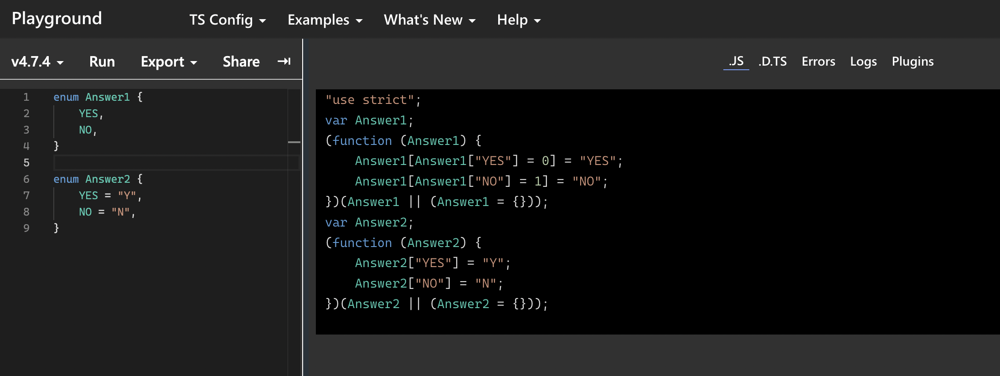

# Enum

특정 값들의 집합을 의미하는 자료형

```typescript
enum Direction {
  Up,
  Down,
  Left,
  Right,
}
```

```typescript
enum Direction {
  Up = 1,
  Down,
  Left,
  Right,
}
```

첫 번째 값에 값을 할당하면 뒤따르는 값들은 자동으로 증가된 값을 가진다.

```typescript
enum Direction {
  Up = "UP",
  Down = "DOWN",
  Left = "LEFT",
  Right = "RIGHT",
}
```

다음과 같이 문자로 초기화할 수도 있다. 이러면 _(당연히)_ 자동으로 증가하진 않는다.

# 활용

어디다 활용할 수 있는걸까?

```typescript
function askQuestion(answer: string) {
  if (answer === "yes") {
    console.log("정답입니다");
  }
  if (answer === "no") {
    console.log("오답입니다");
  }
}

askQeustion("NNN"); // 이런 잘못된 사용을 막지 못한다
```

```typescript
enum Answer {
  YES = "Y",
  NO = "N",
}

function askQuestion(answer: Answer) {
  if (answer === Answer.YES) {
    console.log("정답입니다");
  }
  if (answer === Answer.No) {
    console.log("오답입니다");
  }
}

askQeustion("NNN"); // 자료형을 Answer로 명시해줬기 때문에 빨간 줄이 뜬다
askQeustion(Answer.YES); // 이런 사용만 된다
```


</img>

enum을 컴파일하면, 열거형(숫자)는 정방향 매핑과 역방향 매핑 두 정보를 모두 저장하는 객체로 컴파일된다.
그러나 문자열 열거형은 역 매핑을 생성하지 않는다.


# 참고자료
- (TypeScript: Handbook - Enums)[https://www.typescriptlang.org/ko/docs/handbook/enums.html]