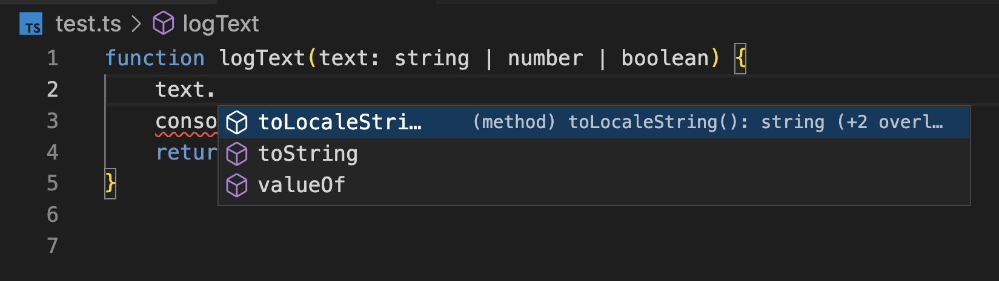
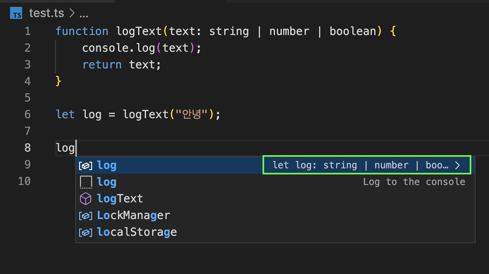

자바스크립트에서는 타입이 없기 때문에 아래와 같은 활용이 가능하다.

```javascript
function logText(text) {
  console.log(text);
  return text;
}

logText(10);
logText("안녕");
logText(true);
```

하지만 타입스크립트에서 파라미터에 타입을 명시해준다면,

```typescript
function logText(text: string) {
  console.log(text);
  return text;
}

logText(10); // 오류 발생!
logText("안녕");
logText(true); // 오류 발생!
```

파라미터가 string으로 제한되기 때문에 _당연히_ 오류가 발생하게 된다.

그렇다면 어떻게 해줘야 할까?

```typescript
function logText(text: any) {}
```

위처럼 `any` 타입을 써야할까? 그러면 타입스크립트를 쓰는 이유가 없어진다.

```typescript
function logTextNumber(text: number) {}
function logTextString(text: string) {}
function logTextBoolean(text: boolean) {}
```

위처럼 세개의 함수를 정의해줘야할까? 그건 너무 힘들다.

그럼 유니온 타입을 쓰면 되지 않을까?

```typescript
function logText(text: string | number | boolean) {
  console.log(text);
  return text;
}
```

문제가 해결된 것 같다. 하지만 이렇게 했을 때 전혀 다른 문제가 생긴다.

</img>

먼저 함수 내부에서 인자를 사용할 때, 인자의 값이 `string | number | boolean` 유니온 타입으로 제한되어 세 타입의 교집합 프로퍼티만을 사용할 수 있다.

</img>

리턴받은 값도 마찬가지로 `string | number | boolean` 유니온 타입이 되어버린다.

그래서 나온것이 **제너릭**이다. **제너릭을 사용하면 함수를 호출하는 시점에 인수의 타입을 지정할 수 있다.**

```typescript
function logText<Type>(text: Type): Type {
  console.log(text);
  return text;
}

logText<number>(10); // 호출하는 시점에 타입을 결정한다!
logText<string>("안녕");
logText<boolean>(true);
```

# 제네릭 활용 사례

API로부터 데이터를 받아서 드롭다운을 셋팅하는 상황을 가정해보자.

```javascript
const emails = [
  { value: "naver.com", selected: true },
  { value: "gmail.com", selected: false },
  { value: "hanmail.net", selected: false },
];

const ages = [
  { value: 10, selected: true },
  { value: 20, selected: false },
  { value: 30, selected: false },
];

// 드롭다운 옵션 DOM 을 반환하는 함수
function createDropdown(item) {
  const option = document.createElement("option");
  option.value = item.value.toString();
  option.innerText = item.value.toString();
  option.selected = item.selected;
  return option;
}

emails.forEach(function (email) {
  const item = createDropdown(email);
  document.querySelector("#email-dropdown").appendChild(item);
});
```

자바스크립트에선 `createDropdown` 함수가 문제가 없다.
하지만 타입스크립트를 사용한다면?

```typescript
function createDropdown(item: { value: string; selected: boolean }) {}
```

이렇게 파라미터의 타입을 명시하는 순간 `createDropdown` 함수의 사용성이 제한되어버린다.

```javascript
const emails = [
  { value: "naver.com", selected: true },
  { value: "gmail.com", selected: false },
  { value: "hanmail.net", selected: false },
];

const ages = [
  { value: 10, selected: true },
  { value: 20, selected: false },
  { value: 30, selected: false },
];
```

이 두 객체는 `{ value: string; selected: boolean; }` `{ value: number; selected: boolean; }` value의 타입만 다르고 포맷이 동일하다. 우리는 인터페이스에 제너릭을 사용해서 두 객체를 위한 인터페이스를 만들 수 있다.

```typescript
interface DropdownItem<T> {
  value: T;
  selected: boolean;
}

const emails: DropdownItem<string>[] = [
  { value: "naver.com", selected: true },
  { value: "gmail.com", selected: false },
  { value: "hanmail.net", selected: false },
];

const ages: DropdownItem<number>[] = [
  { value: 10, selected: true },
  { value: 20, selected: false },
  { value: 30, selected: false },
];
```

이제 파라미터에 제네릭을 넘겨서 아래처럼 두 가지 타입에 대해서 사용할 수 있어졌다.

```typescript
function createDropdown(item: DropdownItem<string> | DropdownItem<number>) {
  const option = document.createElement("option");
  option.value = item.value.toString();
  option.innerText = item.value.toString();
  option.selected = item.selected;
  return option;
}
```

그런데 이것조차 (인자의 타입들 조차) 함수를 호출할 때 넘겨줄 순 없는걸까? 이렇게 하면 된다.

```typescript
function createDropdown<T>(item: DropdownItem<T>) {
  const option = document.createElement("option");
  option.value = item.value.toString();
  option.innerText = item.value.toString();
  option.selected = item.selected;
  return option;
}
```

**잠깐!! 아직 좀 부족함**
