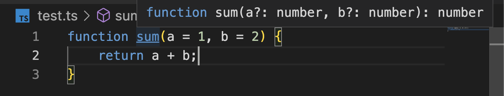

# 타입 추론

TypeScript는 반드시 변수의 유형을 지정해주지 않아도 된다. TypeScript는 Type을 명시적으로 지정해주지 않았을 때 변수의 Type을 유추한다.

TypeScript 컴파일러는 다음과 같은 경우 유형을 유추한다.

1. 변수가 초기화 될 때
2. 매개변수에 대한 기본값이 설정될 때
3. 함수의 반환 유형이 결정 될 때

```typescript
let x = 3; // 는 let x: number 로 추론된다.
let y = "HI"; // 는 let y: string 로 추론된다.
x = y; // Compiler Error!
```

따라서 위의 예제는 마지막 줄에서 컴파일러 에러가 난다.

# Best Common Type

`let arr = [10, null, 30, 40];` 같은 배열이 있다면 TypeScript는 `Best Common Type` 즉, 가장 일반적인 타입을 찾는다. 이 경우 null와 숫자가 호환되는 `(number | null)[]` 유니온 타입으로 추론된다.

앞서 매개변수의 기본값이 설정될 때와 함수의 반환 유형이 결정될 때에도 타입추론이 일어난다고 했다. _알다시피 ES6 부터는 매개변수에 기본값을 설정해줄 수 있다._

</img>

따라서 위 예제에서, 파라미터의 기본값을 설정해줬으므로 `a` 는 number로 추론되고, 기본값을 넘겼으므로 반드시 변수를 할당해 줄 필요가 없기 때문에 `a?: number` 로 추론이 된다. 반환값 또한 number와 number의 합이기 때문에 number로 추론되는 것을 볼 수 있다.

# TypeScript Language Server

이런 타입추론은 어떻게 일어나는 것일까? IDE 내부적으로 TypeScript Language Server 가 돌고있기 때문이다.

## 언어서버란?

언어 서버는 다양한 프로그래밍 언어에 대한 편집 환경을 제공하는 VS Code 의 extension이다. 언어 서버를 사용하면, 자동 완성이나 오류 검사, 정의로 이동 등 VS Code 에서 지원되는 여러 언어기능을 구현할 수 있다.

하지만 이런 언어서버에는 문제가 있는데, 보통 이런 언어서버는 각 언어의 네이티브 프로그래밍 언어로 구현되어 있다. 따라서 _(일렉트론으로 구현되어)_ Node.js 런타임이 있는 VS Code와 통합하는데 어려움이 있다.

따라서 네이티브 프로그래밍 언어로 구현하지 않고 IDE 의 프로그래밍 언어로 작성하기도 한다. Eclipse에서 C, C++를 지원하는 Eclipse CDT 플러그인은 Eclipse가 Java여서 플러그인 또한 Java로 작성되어 있다.

하지만 이런 라이브러리는 자신의 언어로 구현되어야 더 쉽고, 더 좋다. (예를들어 좋은 C, C++ 도메인 모델은 C, C++ 에서 구현됨) 전혀 다른 언어로 작성된 IDE 에 통합하는것은 기술적으로는 가능하지만 어렵다.

또한 이런 언어 서버는 (파일을 구문분석하고, 정적 프로그램 분석을 수행하는 등의 일을 해야하기 때문에) 리소스를 많이 사용한다.

## 언어 서버 프로토콜

따라서 MS는 이런 문제를 해결하기 위해서 언어 서버 프로토콜 (이하 LSP)를 지정했다.

</img>

# 참고자료

- (TypeScript HandBook | Type Inference)[https://www.typescriptlang.org/docs/handbook/type-inference.html]
- (Visual Studio Code | Language Server Extension Guide)[https://code.visualstudio.com/api/language-extensions/language-server-extension-guide]
- (MS doc | Language Server Protocole)[https://docs.microsoft.com/ko-kr/visualstudio/extensibility/language-server-protocol?view=vs-2019]
